# Mermaid作图

## Mermaid简洁


Mermaid是一个基于Javascript的图表绘制工具，它使用Markdown内置的文本定义以及渲染器来创建和修改复杂的图表。Mermaid的主要目的是帮助文档跟上开发。

- 源码地址
<https://github.com/mermaid-js/mermaid>
- 官网教程
<https://mermaid-js.github.io/mermaid/#/>

**优点：**

- 支持Markdown
- 免费开源
- 跨平台
- 轻量

## 流程图(Flowchat)

### 语法格式

```` text
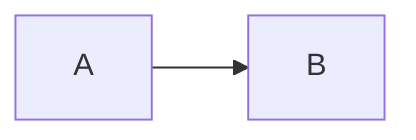
````


>**Note:**  
>`graph`表示这是一个流程图  
> `LR`表示方向  
>`A` `B`表示节点  
>`-->`表示连接线

### 方向(direction)

``` text
LR
```

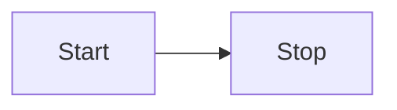

``` text
TD
```

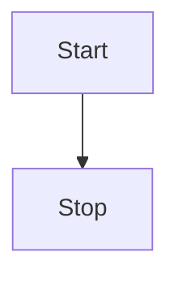

- TB - 由上至下
- TD - 由上至下
- BT - 由下至上
- RL - 由右至左
- LR - 由左至右

### 节点(node)

``` text
id
```

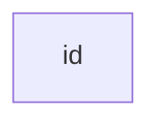

> **Note** id显示在方框中

``` text
id[This is the text in the box]
```

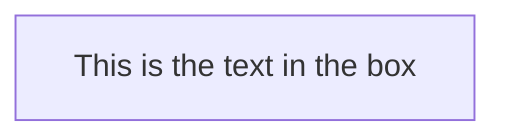

> **Note** 可通过[]另外指定显示在方框中的文字

圆边

``` text
id(The text)
```

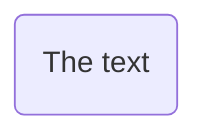

体育场

``` text
id([The text])
```


子程序

``` text
id[[The text]]
```

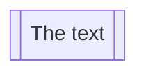

圆柱

``` text
id[(The text)]
```

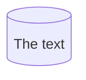

圆

``` text
id((The text))
```

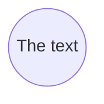

非对称

``` text
id>The text)
```

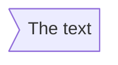

菱形

``` text
id{The text}
```

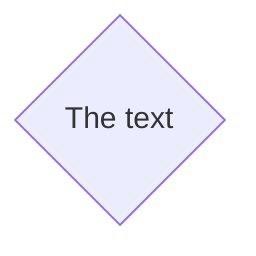

六角形

``` text
id{{The text}}
```

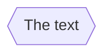

平行四边形

``` text
id[/he text/]
```

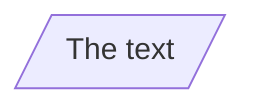

``` text
id[\he text\]
```

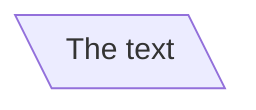

梯形

``` text
id[/he text\]
```

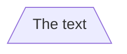

``` text
id[\he text/]
```

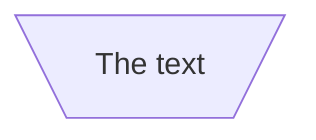

### 连接线(link)

## 时序图(Sequence diagrams)

## 类图(Class diagrams)

## 甘特图(Gantt diagrams)

## 饼图(Pie chart diagrams)
