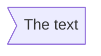

# Mermaid作图

## Mermaid简介


Mermaid是一个基于Javascript的图表绘制工具，它使用Markdown内置的文本定义以及渲染器来创建和修改复杂的图表。Mermaid的主要目的是帮助文档跟上开发。

- 源码地址
<https://github.com/mermaid-js/mermaid>
- 官网教程
<https://mermaid-js.github.io/mermaid/#/>

**优点：**

- 支持Markdown
- 免费开源
- 跨平台
- 轻量
- 可脚本化

## 流程图(Flowchat)

示例


### 定义流程图

```` text
​``` mermaid
graph LR
  A --> B
​```
````


>**Note:**  
>`graph`表示这是一个流程图  
> `LR`表示方向  
>`A` `B`表示节点  
>`-->`表示连接线

### 方向(direction)

``` text
LR
```


``` text
TD
```


- TB - 由上至下
- TD - 由上至下
- BT - 由下至上
- RL - 由右至左
- LR - 由左至右

### 节点(node)

``` text
id
```


> **Note** id显示在方框中

``` text
id[This is the text in the box]
```


> **Note** 可通过[]另外指定显示在方框中的文字

圆角

``` text
id(The text)
```


体育场

``` text
id([The text])
```


子程序

``` text
id[[The text]]
```


圆柱

``` text
id[(The text)]
```


圆

``` text
id((The text))
```


非对称

``` text
id>The text)
```



菱形

``` text
id{The text}
```


六角形

``` text
id{{The text}}
```


平行四边形

``` text
id[/he text/]
```


``` text
id[\he text\]
```


梯形

``` text
id[/he text\]
```


``` text
id[\he text/]
```


### 连接线(link)

箭头

``` text
A --> B
```


``` text
A -- Text on link --> B

or

A -->| Text on link | B
```


实线

``` text
A --- B
```

```mermaid
graph LR
  A --- B
```

``` text
A -- Text on link --- B

or

A ---| Text on link | B
```

``` mermaid
graph LR
  A -- Text on link --- B
```

虚线

``` text
A -.-> B
```

``` mermaid
graph LR
  A -.-> B
```

``` text
A -. Text on the link .-> B

or

A -.->| Text on the link | B
```

``` mermaid
graph LR
  A -. Text on the link .-> B
```

粗线

``` text
A ==> B
```

``` mermaid
graph LR
  A ==> B
```

``` text
A == Text on the link ===> B

or

A ==>| Text on the link | B
```

``` mermaid
graph LR
  A == Text on the link ===> B
```

链

``` text
A --> B
B --> C

or

A --> B --> C
```

``` mermaid
graph LR
  A --> B --> C
```

``` text
A --> B
A --> C
B --> D
C --> D

or

A --> B & C --> D
```

``` mermaid
graph LR
  A --> B & C --> D
```

长连接线

``` text
A --> B --> C
A ---> D
```

``` mermaid
graph LR
  A --> B --> C
  A ---> D
```

连接线长度对照表

| Length | 1 | 2 | 3 |
| ------ | --- | --- | --- |
| Normal | \-\-\- | ---- | ----- |
| Normal with arrow | \-\-> | \-\-\-> | ----> |
| Thick | === | ==== | ===== |
| Thick with arrow | ==> | ===> | ====> |
| Dotted | -.- | -.\.- | -...- |
| Dotted with arrow | -.-> | -.\.-> | -...-> |

特殊字符

``` text
id["This is the (text) in the box"]
```

``` mermaid
graph LR
  id["This is the (text) in the box"]
```

>**Note:** 括号属于特殊字符，这里如果没有用双引号把文字包起来将报错

子图

``` text
subgraph s1[one]
  A1 --> A2
end
subgraph s2[two]
  B1 --> B2
end
subgraph s3[three]
  C1 --> C2
end
C1 --> A2
D --> A2
```

``` mermaid
graph TD
  subgraph s1[one]
    A1 --> A2
  end
  subgraph s2[two]
    B1 --> B2
  end
  subgraph s3[three]
    C1 --> C2
  end
  C1 --> A2
  D --> A2
```

## 类图(Class diagrams)

示例

``` mermaid
classDiagram
  class Animal
  Animal <|-- Duck
  Animal <|-- Fish
  Animal <|-- Zebra
  Animal: +int age
  Animal: +String gender
  Animal: +isMammal()
  Animal: +mate()
  class Duck{
    +String beakColor
    +swim()
    +quack()
  }
  class Fish{
    -int sizeInFeet
    -canEat()
  }
  class Zebra{
    +bool is_wild
    +run()
  }
```

### 定义类图

```` text
​``` mermaid
classDiagram
  class A{
    +int age
    +run()
  }
  class B{
    +String name
    +speak()
  }
  A <|-- B
​```
````

``` mermaid
classDiagram
  class A{
    +int age
    +run()
  }
  class B{
    +String name
    +speak()
  }
  A <|-- B
```

>**Note:**  
>`classDiagram`表示这是一个类图  
>`class A`定义一个类  
>`+int age`定义类的成员变量  
>`+run()`定义类的成员函数  
>`<|--`定义两个类之间的关系

### 类成员

使用:（冒号）

```` text
​``` mermaid
classDiagram
  class BankAccount
  BankAccount : +String owner
  BankAccount : +BigDecimal balance
  BankAccount : +deposit(amount)
  BankAccount : +withdrawal(amount)
​```
````

``` mermaid
classDiagram
  class BankAccount
  BankAccount : +String owner
  BankAccount : +BigDecimal balance
  BankAccount : +deposit(amount)
  BankAccount : +withdrawal(amount)
```

使用{}（大括号）

```` text
​``` mermaid
classDiagram
  class BankAccount{
    +String owner
    +BigDecimal balance
    +deposit(amount)
    +withdrawl(amount)
  }
​```
````

``` mermaid
classDiagram
  class BankAccount{
    +String owner
    +BigDecimal balance
    +deposit(amount)
    +withdrawl(amount)
  }
```

>**Note:** Mermaid根据是否存在括号()来区分属性和函数/方法，带()的被视为函数/方法，反之则被视为属性

返回类型

``` text
+deposit(amount) bool
+withdrawl(amount) int
```

``` mermaid
classDiagram
  class BankAccount{
    +deposit(amount) bool
    +withdrawl(amount) int
  }
```

>**Note:** 可以在函数/方法定义的结尾加上返回的数据类型，方法定义和返回类型之间必须留有一个空格

抽象/静态

``` text
 +deposit(amount)* bool
 +withdrawl(amount)$
```

``` mermaid
classDiagram
  class BankAccount{
    +deposit(amount)* bool
    +withdrawl(amount)$
  }
```

>**Note:** 在方法后面增加`*`表示抽象，增加`$`表示静态

权限

- `+` Public
- `-` Private
- `#` Protected
- `~` Package/Internal

### 关系

|Type|Description|
|---|---|
|-\-\|>|继承(Inheritance)|
|-\-*|复合(Composition)|
|-\-o|聚合(Aggregation)|
|-\->|关联(Association)|
|.\.>|依赖(Dependency)|
|.\.\|>|实现(Realization)|
|-\-|Link(Solid)|
|.\.|Link(Dashed)|

``` text
classA <|-- classB
classC *-- classD
classE o-- classF
classG <-- classH
classK <.. classL
classM <|.. classN
classI -- classJ
classO .. classP
```

``` mermaid
classDiagram
  classA <|-- classB
  classC *-- classD
  classE o-- classF
  classG <-- classH
  classK <.. classL
  classM <|.. classN
  classI -- classJ
  classO .. classP
```

可以使用标签来描述两个类之间的关系性质。此外箭头也可以用于相反的方向

``` text
classA --|> classB : Inheritance
classC --* classD : Composition
classE --o classF : Aggregation
classG --> classH : Association
classK ..> classL : Dependency
classM ..|> classN : Realization
classI -- classJ : Link(Solid)
classO .. classP : Link(Dashed)
```

``` mermaid
classDiagram
  classA --|> classB : Inheritance
  classC --* classD : Composition
  classE --o classF : Aggregation
  classG --> classH : Association
  classK ..> classL : Dependency
  classM ..|> classN : Realization
  classI -- classJ : Link(Solid)
  classO .. classP : Link(Dashed)
```

## 时序图(Sequence diagrams)

``` mermaid
sequenceDiagram
  autonumber
  Alice->>John: Hello John, how are you?
  loop Healthcheck
    John->>John: Fight against hypochondria
  end
  Note right of John: Rational thoughts!
  John-->>Alice: Great!
  John->>Bob: How about you?
  Bob-->>John: Jolly good!
```

## 甘特图(Gantt diagrams)

``` mermaid
gantt
  dateFormat  YYYY-MM-DD
  title       Adding GANTT diagram functionality to mermaid
  excludes    weekends

  section A section
  Completed task            :done,    des1, 2014-01-06,2014-01-08
  Active task               :active,  des2, 2014-01-09, 3d
  Future task               :         des3, after des2, 5d
  Future task2              :         des4, after des3, 5d

  section Critical tasks
  Completed task in the critical line :crit, done, 2014-01-06,24h
  Implement parser and jison          :crit, done, after des1, 2d
  Create tests for parser             :crit, active, 3d
  Future task in critical line        :crit, 5d
  Create tests for renderer           :2d
  Add to mermaid                      :1d

  section Documentation
  Describe gantt syntax               :active, a1, after des1, 3d
  Add gantt diagram to demo page      :after a1  , 20h
  Add another diagram to demo page    :doc1, after a1  , 48h

  section Last section
  Describe gantt syntax               :after doc1, 3d
  Add gantt diagram to demo page      :20h
  Add another diagram to demo page    :48h
```

## 饼图(Pie chart diagrams)

``` mermaid
pie
  title Key elements in Product X
  "Calcium" : 42.96
  "Potassium" : 50.05
  "Magnesium" : 10.01
  "Iron" :  5
```

